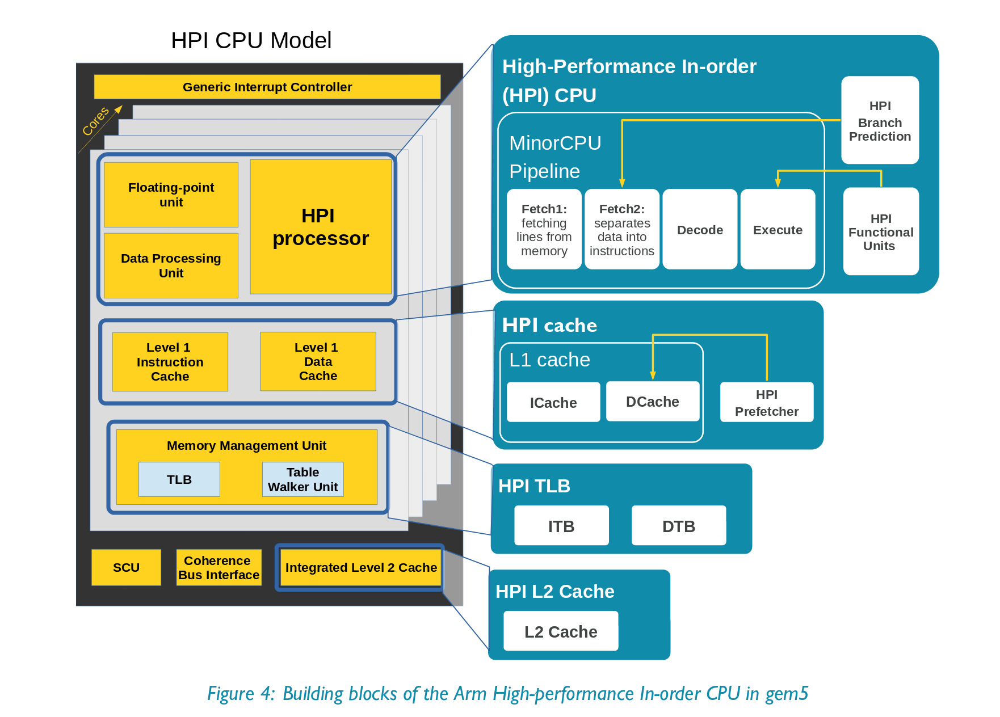

#### gem5 in-order CPU models

Ο προσομοιωτής gem5 χρησιμοποιεί τα εξής in-order cpu μοντέλα: MinorCPU, SimpleCPU και HPI.

Το MinorCPU είναι ένα in-order μοντέλο με fixed pipeline αλλά διαμορφώσιμες δομές δεδομένων και συμπεριφορά εκτέλεσης (execute behavior). Προσομοιώνει επεξεργαστές με αυστηρή in-order συμπεριφορά εκτέλεσης.  Περιέχει ένα container για τον αγωγό (pipeline), εντολή Fetch1 για την ανάκτηση δεδομένων απ τις γραμμές της cache μνήμης με διεπαφή IcachePort για την l-cache, Fetch2 για την αποσύνθεση της εντολής, Decode στάδιο για την αποκωδικοποίηση micro-op και στάδιο της εκτέλεσης της εντολής (Execute) και διεπαφής της μνήμης δεδομένων με LSQ ουρά αποθήκευσης για memory ref. instructions.

Το SimpleCPU μοντέλο είναι ένα καθαρά λειτουργικό in-order μοντέλο για περιπτώσεις που ένα λεπτομερές μοντέλο δεν είναι απαραίτητο. Χωρίζεται σε τρεις κατηγορίες: BaseSimpleCPU, AtomicSimpleCPU και TimingSimpleCPU. 
1)Το BaseSimpleCPU ορίζει λειτουργίες για τον έλεγχο των interrupts, τη ρύθμιση του fetch request, τον χειρισμό post-execute δράσεων, και τη προώθηση του υπολογιστή στην επόμενη εντολή. Παρόλα αυτά δεν μπορεί να τρέξει μόνο του και πρέπει να χρησιμοποιήσει μία απ τις κλάσεις, είτε το AtomicSimpleCPU είτε το TimingSimpleCPU.  
2)Το AtomicSimpleCPU είναι έκδοση του SimpleCPU που χρησιμοποιεί πρόσβαση σε ατομική μνήμη (atomic memory accesses). Χρησιμοποιεί τις εκτιμήσεις λανθάνοντος χρόνου (latency) απ τις ατομικές προσβάσεις για να υπολογίσει το συνολικό χρόνο πρόσβασης στη cache. Προέρχεται απ το BaseSimpleCPU και υλοποιεί λειτουργίες για ανάγνωση και εγγραφή μνήμης, καθώς επείσης και τη μέτρηση tick, η οποία καθορίζει τι συμβαίνει σε κάθε κύκλο CPU. Ορίζει το port που χρησιμοποιείται για να συνδεθεί η μνήμη και συνδέει τη CPU με την cache. 
tick()-->setupFetchRequest()/translateAtomic()-->sendAtomic()-->preExecute()-->execute()-->postExecute() 

3)To TimingSimpleCPU είναι η έκδοση του SimpleCPU που χρησιμοποιεί timing memory accesses. Σταματάει στις προσβάσεις κρυφής μνήμης και περιμένει το σύστημα μνήμης να ανταποκριθεί πριν προχωρήσει. Όπως και το AtomicSimpleCPU, το TimingSimpleCPU προέρχεται επίσης από το SimpleCPU και εφαρμόζει το ίδιο σύνολο λειτουργιών. Ορίζει τη θύρα που χρησιμοποιείται για να συνδεθεί στη μνήμη και συνδέει τη CPU με την κρυφή μνήμη. Ορίζει επίσης τις απαραίτητες λειτουργίες για τον χειρισμό της απόκρισης από τη μνήμη στα acceses που έχουν σταλεί.  

 

Το High-Performance In-order CPU (HPI) αντιπροσωπεύει έναν σύγχρονο in-order Armv8-A επεξεργαστή. Το pipeline του χρησιμοποιεί τα ίδια 4 στάδια όπως ο MinorCPU.

  
Sources:  
[MinorCPU](http://www.gem5.org/docs/html/minor.html)  
[SimpleCPU](http://www.m5sim.org/SimpleCPU)  
[HPI](https://github.com/arm-university/arm-gem5-rsk/blob/master/gem5_rsk.pdf)
